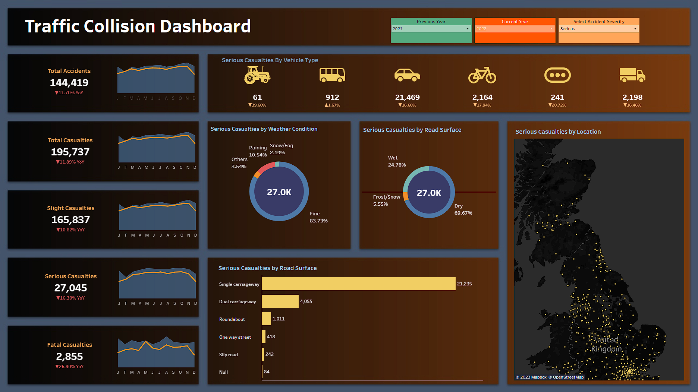
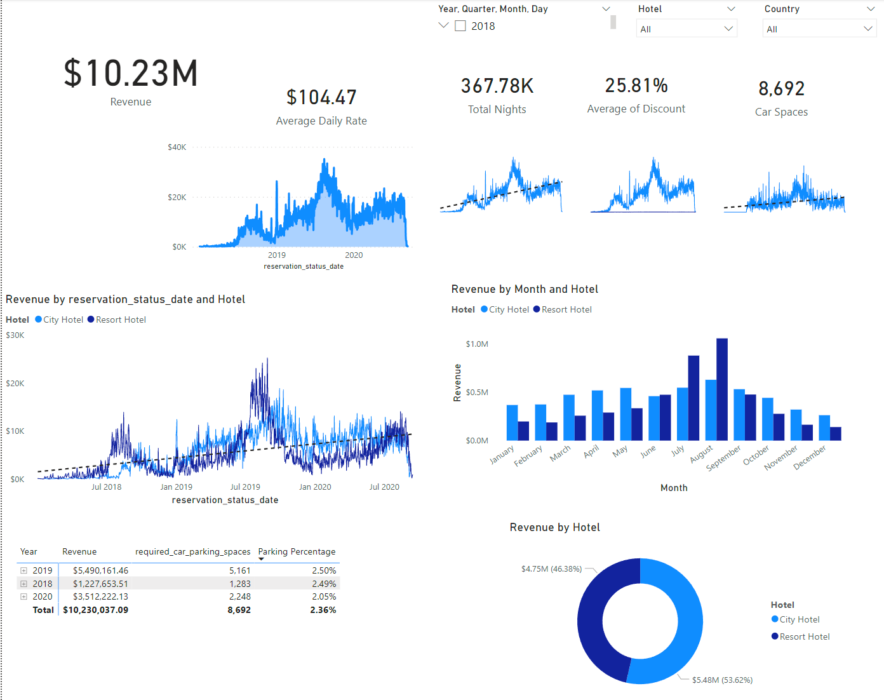

# DataAnalystPortfolio
## Following are my projects in SQL, Python, Tableau, PowerBI & Excel:  
#### *You can take a look at my personal website : [https://randygriffin.github.io/DataPortfolio/](https://randygriffin.github.io/DataPortfolio/)*  
#### *You can also take a look at my Linkedin : [RandyGriffin](https://www.linkedin.com/in/randy-j-griffin/)*  

- [x] **Tableau** - 

*To view these Tableau Dashboards in Tableau Public, click on the hypertext link.*

- Traffic Collisions Dashboard  
 https://public.tableau.com/views/TrafficCollisions_16783825121810/Dashboard?:language=en-US&publish=yes&:display_count=n&:origin=viz_share_link
 
 

- [x] **PowerBI** - 

- Hotel Revenue Data Analysis Dashboard 
 https://app.powerbi.com/view?r=eyJrIjoiOTFmYzdhYzMtNDRiZS00NDQ3LTkxNWEtYWQ0Y2EyYmQ3ZThlIiwidCI6IjBmMDRhMDk5LTZkYzctNDRmZC1hODc1LTAwOTIyOTA2ZmM5YiIsImMiOjZ9
 
 *Review the SQL Script:* **[HERE](https://github.com/RandyGriffin/DataAnalystPortfolio/blob/main/sql_raw/HotelSQL)** 
 
 

- [x] **Python** - 
  - Mall Customers Dataset: Exploratory Data Analysis Project  
*Read the complete Project Analysis in PDF:* **[HERE](https://github.com/RandyGriffin/DataAnalystPortfolio/blob/main/MallCustomersData.pdf)** 
